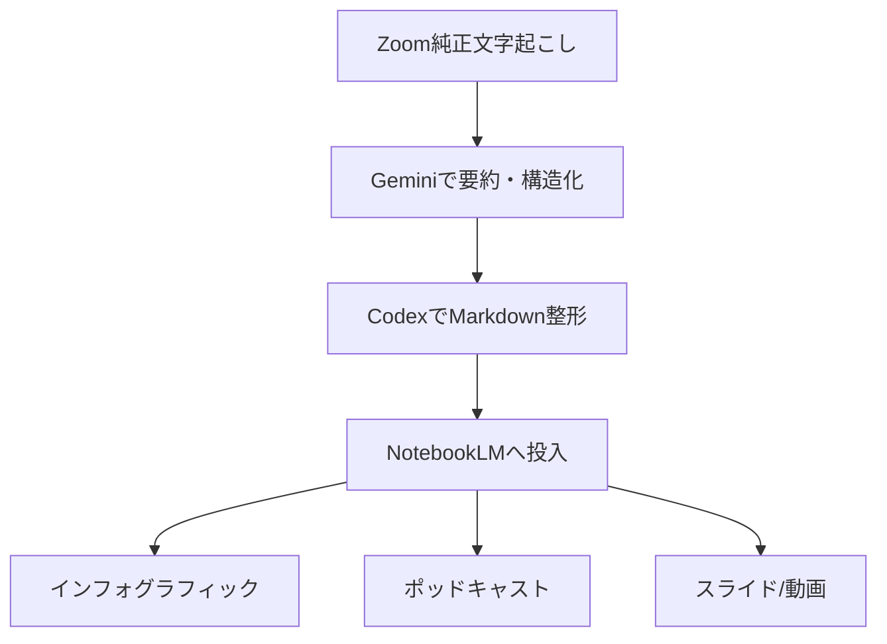

> [!tip] 🎧 このセッション録をポッドキャストで聴く
> NotebookLM Audio Overview が、第1回の要点を対談形式で解説します。
>
> 

# 第1回 生成AIチュートリアル — 比呂美さん

> **参加者**: 長田（コーチ）／ 比呂美さん（受講者・正式表記要確認）  
> **日時**: 2026年8月4日（火）13:15頃〜15:30頃（Zoom文字起こし上 約2時間15分）  
> **形式**: オンライン（Zoom）  
> **位置づけ**: 第0回インテーク後の初回実践セッション  
> **前回**: [第0回生成AIチュートリアル](第0回生成AIチュートリアル.html)

---

> [!abstract] 概要
> 第1回は、前日の[第0回インテーク](第0回生成AIチュートリアル.html)で作成したセッション録・ポッドキャスト・インフォグラフィックを見ながら、AIが長い会話を「要点化し、再利用できる形」に変える力を確認するところから始まった。続いて、ChatGPTの使い方を「単発チャット」から「プロジェクト＝継続的な職場」へ広げる考え方を扱い、後半ではGemini Notebook / NotebookLMを実際に操作した。NPO法人アットオーティズムやLight It Up Blue関連の情報をソースに入れ、クイズ・インフォグラフィック・音声・動画・マインドマップ・レポートへ展開できることを体験した。

---

## 1. 今回の位置づけ

第0回は、比呂美さんの現在地と、ASD啓発活動・Light It Up Blue関連業務におけるAI活用余地を把握するインテークだった。

今回の第1回は、そこから一歩進み、実際のAIサービスを触りながら、次の3点を体感する回になった。

1. 長い対話や資料を、AIで要点化・図解・音声化できること
2. ChatGPTは単発質問だけでなく、プロジェクトとして継続管理できること
3. NotebookLM/Gemini Notebookは、NPOの資料・Webサイト・録音を「使える素材」に変換できること

---

## 2. 第0回成果物から見えたAI活用のイメージ

冒頭では、前日に作成した第0回セッション録、ポッドキャスト、インフォグラフィックの見え方を確認した。

比呂美さんは、長い会話が要点に整理され、さらに音声や図解として再構成されることに反応した。特に、実際のミーティングでは話が脱線したり、順序が前後したりしても、AIに「その日の議題やポイント」を掴ませれば、必要な形にまとめ直せるという理解が進んだ。

長田からは、今回の成果物は「AIでここまでできる」というイメージを持ってもらうため、少し大きめに作っていることも説明された。単に記録を残すだけでなく、あとから読み返す・聞く・見せる・深掘りする材料にできることが、この最初の確認ポイントだった。

---

## 3. Zoom文字起こしと画面共有の確認

序盤では、比呂美さん側のZoom画面で、文字起こし/字幕が英語ベースで表示されている問題が話題になった。画面共有で状況を確認しようとしたが、共有対象の選択やZoom画面の見え方に少し手間取った。

この点は今回の本題ではなかったため深追いはせず、Zoom側の設定問題として扱った。今回のセッション録自体は、Zoomポータルから取得した純正文字起こしを一次素材として作成している。

> [!note] 作成上の扱い
> 文字起こしには、英語・ローマ字の自動認識ノイズが多く混じっていた。本文では、明らかな認識ノイズは除き、日本語として意味が取れる内容を中心に整理した。

---

## 4. セッション録ができるまでの流れ

比呂美さんから、第0回のような成果物がどのように作られたのかという関心が出たため、長田は制作フローを説明した。

大まかな流れは次の通り。

ポイントは、1つのAIだけで全部を済ませるのではなく、文字起こし、要約、整形、音声化・図解化を分担させることだった。これにより、長いセッションも、読み物・音声・図解の複数形式で再利用できる。

---

## 5. ChatGPT：単発チャットから「プロジェクト＝職場」へ

次に、比呂美さんが普段どの環境でChatGPTを使っているかを確認した。PCではWeb版、スマホではアプリを使っていることが確認された。

長田は、ChatGPTの利用を次のように整理した。

- **チャット**: その場で相談する対話の場所
- **Work/アプリ系機能**: 机の上に道具を並べるように、必要な機能を使う場所
- **プロジェクト**: 継続的な仕事場・職場

比呂美さんは、スマホ側で既にいくつかプロジェクトを作っていた。ここで重要になったのは、プロジェクトは単なるフォルダではなく、同じテーマの文脈を継続して扱う「職場」として考えることだった。

長田は、ChatGPTのメモリには限界があり、全部を覚え続けることはできないため、セッション録やプロジェクトに情報を置く必要があると説明した。そうしないと、毎回「別人が来て、最初から説明し直す」状態になってしまう。

> [!important] 今回のキーワード
> **プロジェクトは職場。**  
> 何度も使うテーマ、過去資料、前回までの要点は、単発チャットではなくプロジェクト側に置いていく。

---

## 6. Gemini Notebook / NotebookLMを触る

後半の中心は、Gemini Notebook / NotebookLMの実習だった。

比呂美さんはChromeを開き、NotebookLMにアクセスした。画面は大きく3つの領域に分かれていることを確認した。

| 領域 | 役割 |
|---|---|
| 左 | ソースを追加する場所。Webサイト、ファイル、YouTube、録音などを入れる。 |
| 中央 | 入れたソースについて質問するチャット欄。 |
| 右 | スタジオ機能。クイズ、インフォグラフィック、音声、動画、マインドマップ、レポートなどを作る。 |

ここで強調されたのは、NotebookLMは「一般知識から何でも答えるAI」というより、**入れた資料の中だけを根拠に答えるAI**として使える点である。

NPO法人アットオーティズムやLight It Up Blue関連のWeb情報を入れることで、その情報だけをもとに質問したり、説明資料を作ったりできる。

---

## 7. LIUB/ASD啓発資料への応用

NotebookLM上では、アットオーティズムや世界自閉症啓発に関する情報をもとに、複数の生成を試した。

### 7.1 クイズ

クイズ生成では、難易度や問題数を変えながら、啓発イベント向けの問題を作れることを確認した。

比呂美さんは、毎年イベントでクイズを作っているため、ここにすぐ実務応用の可能性を見出した。難易度を下げれば、子どもにも分かりやすい問題にできることも確認した。

### 7.2 インフォグラフィック

インフォグラフィック生成では、資料を一枚ものの視覚資料に変換できることを確認した。比呂美さんは、以前本部側で作っていたような資料に近いと反応し、「これもこのまま使いたい」と感じていた。

色味、縦横比、子ども向け/未来的などのデザイン指定、トーン&マナーの調整が可能であることも説明された。

### 7.3 音声・動画・マインドマップ・レポート

NotebookLMのスタジオ機能として、音声解説、動画解説、マインドマップ、レポートなども確認した。

特に音声では、ASDやLIUBに関する資料をもとにした対話風の解説を試聴し、比呂美さんは「聞き入ってしまう」と反応した。長田からは、AI音声にはまだ読み間違いもあるが、AIが作ったものとして受け止めてもらう前提なら、硬すぎる資料より伝わりやすい可能性があると説明された。

---

## 8. 英語資料・YouTube・録音をどう扱うか

比呂美さんは、英語資料をこれから読もうとしていることも話した。長田は、長い英語資料やYouTubeはNotebookLMに入れてよいと説明した。

日本語環境で使っている場合、英語資料を入れても日本語で要約・音声化されることが多い。英語のまま扱いたい場合は、そのように指示する必要がある。

また、スマホのボイスメモで録音したものも、NotebookLMアプリへ共有すればソースとして入れられることを確認した。これにより、会議・相談・現場メモなどを後から要点化する導線が見えた。

---

## 9. SNS・広報への広がり

NotebookLMの活用から、写真中心の活動発信、InstagramやFacebookなどのSNS活用にも話が広がった。

比呂美さんは、写真を選び、言葉を添えて発信する作業を、お姉様と相談しながら進めているが、そこに苦手意識もある。長田は、苦手な部分こそAIに相談し、下書きや構成案、投稿文、見せ方をAIに手伝わせる考え方を示した。

特に、Light It Up Blueのように写真・啓発メッセージ・季節性がある活動では、来年4月に向けたティーザー発信や、参加者への案内、イベント後の振り返りコンテンツなどにAIを使える可能性がある。

---

## 10. 宿題

今回の宿題は、次の3つとして整理された。

- [ ] **ChatGPTのメニューを全部押してみる**  
  何がどこにあるか、まずは怖がらずに触ってみる。

- [ ] **AI基本講習を1〜2本、読む/聞く**  
  読むのが大変なものはNotebookLMに入れて、要点化・音声化してもよい。

- [ ] **Gemini Notebook / NotebookLMに気になる資料を入れて試す**  
  Webサイト、資料、YouTube、録音/ボイスメモなどを入れ、クイズ・音声・インフォグラフィックなどがどう出るかを体験する。

> [!tip] 宿題の狙い
> 完璧に覚えることではなく、まず「押す」「入れる」「出てきたものを見る」こと。今回は、勉強してから使うより、作りながら覚える段階。

---

## 11. 次回予定

- **日時**: 2026年8月16日（日）10:00頃
- **想定テーマ**:
  - 宿題の確認
  - ChatGPTプロジェクトの整理
  - NotebookLMに入れた資料の活用
  - LIUB/ASD啓発活動に使える資料・クイズ・SNS文面の具体化

---

## 12. 注意点・守秘配慮

- 比呂美さんの正式氏名・姓・所属/契約主体は、現時点では要確認のため本文では創作しない。
- 画面共有中に出た個人アカウントやパスワード周辺の発話は、本文では扱わない。
- ASD/発達障害に関する記述は、啓発活動・資料整理の文脈に限定し、医療的助言としては扱わない。
- NPO活動の関係者名、連絡先、写真、協賛先等が含まれる可能性があるため、公開・共有時には素材範囲を再確認する。

---

## 13. 次に進めるとよいこと

- [ ] 第1回のNotebookLM用素材を作る
- [ ] 第1回のインフォグラフィック/ポッドキャストを生成する
- [ ] 必要であればGitHub Pages公開版へ反映する
- [ ] 比呂美さんの正式表記・契約主体・LINE userIdを名簿で確定する
