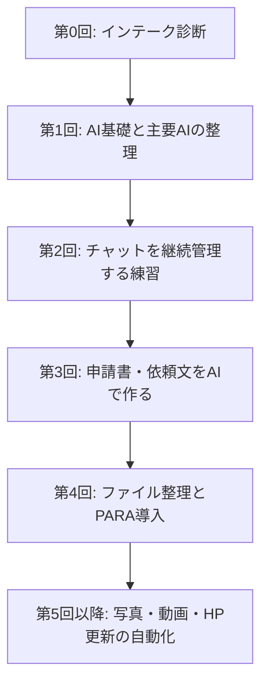

> [!tip] 🎧 このセッション録をポッドキャストで聴く
> NotebookLM Audio Overview が、第0回インテークの要点を対談形式で解説します。
>
> 

# 第0回 生成AIチュートリアル — 比呂美さん インテークセッション

> **参加者**: 長田（コーチ）／ 比呂美さん（受講者・正式表記要確認）  
> **日時**: 2026年8月3日（月） 17:01〜18:39頃（録画上 約1時間37分）  
> **形式**: オンライン（Zoom）  
> **位置づけ**: 本格チュートリアル開始前のインテーク診断

---

> [!abstract] 概要
> 今回は、新しい生成AIチュートリアル開始に向けた比呂美さんのインテークセッションとして、現在のAI利用状況、NPO活動の業務課題、今後の伴走方針を整理した。比呂美さんは、自閉スペクトラム症（ASD）の啓発活動として、毎年4月2日の世界自閉症啓発デーに合わせた「Light It Up Blue」キャンペーンに関わっている。活動は全国500箇所以上のライトアップへ広がる一方、事務局側は少人数で、申請書・協賛依頼・チラシ・写真整理・動画作成・ホームページ更新などの手作業が大きな負担になっている。長田からは、AIを単なる質問相手ではなく「百人力・千人力の秘書」「執事」として使い、比呂美さん自身は構想・判断・人との関係づくりに集中する方向性が提示された。次回からは、主要AIの基礎、チャットの継続管理、フォルダ整理、申請書・広報物作成などを、実際の業務素材を使って進める。

---

## 1. インテークの目的

本セッションの目的は、いきなり操作説明に入ることではなく、比呂美さんがAIで何を実現したいのかを診断することだった。

- 現在どの程度AIを使っているか
- NPO活動のどこに最も負荷がかかっているか
- どの業務からAI化すると効果が大きいか
- 長田の個別伴走が合うか
- 次回以降、どの順番で学ぶべきか
- お姉様も含めた共同受講・共同作業の形をどうするか

結論として、比呂美さんは「AIの一般講座」よりも、実際のNPO業務を題材にしながら、週1回程度で伴走する形式が合うと判断された。

---

## 2. 比呂美さんの現在地

### 2.1 活動背景

比呂美さんは、自閉スペクトラム症（ASD）の子どもたちや家族を支援・啓発するNPO活動に関わっている。中心テーマは、毎年4月2日の世界自閉症啓発デーに合わせた「Light It Up Blue」キャンペーンである。

活動は、2011年に神戸の数箇所から始まり、現在では全国500箇所以上のランドマークが青くライトアップされる規模に広がっている。活動が大きくなったこと自体は大きな成果だが、その分、事務局側の作業量も急増している。

> [!quote] 比呂美さん
> 最初は三箇所だったんですけど、今は500箇所以上のランドマーク的なところをライトアップしてもらえるようになりまして。

### 2.2 現在のAI利用

比呂美さんは、すでにChatGPTの有料プランを日常的に使っている。主な用途は、健康管理のための食事メニュー相談や、旅行ルートの検索などである。

一方で、チャットを継続的なプロジェクトとして管理したり、仕事の流れそのものをAIに持たせたりする段階にはまだ進んでいない。現状は「その場で聞く」使い方が中心であり、今後は「継続的に育てるAI活用」へ移る余地が大きい。

### 2.3 環境面

比呂美さんのMacBook Proは、メモリ48GB級の高性能環境であることが確認された。長田は、この環境であればクラウドAIだけでなく、将来的にローカルAIや文字起こし処理、画像・動画処理にも使える可能性が高いと見立てた。

---

## 3. AIで解きたい課題

### 短期：9月〜10月に始まる準備業務

直近でAI化の効果が大きいのは、秋から始まる翌年4月2日に向けた準備業務である。

- 後援名義・公的機関向けの申請書作成
- チラシ・ポスターの構成案作成
- 協賛依頼状の文面作成
- 活動紹介文・キャッチコピーの作成
- 過去資料をもとにした定型文の再利用

特に、毎年同じような流れで発生する申請書・依頼文・広報文は、AIに過去資料と意図を渡すことで、かなり効率化できる可能性がある。

### 中期：写真・動画・ホームページ更新

活動規模が大きくなったことで、全国から送られてくる写真や参加情報の整理が大きな負担になっている。

- 500箇所以上の参加情報の整理
- ライトアップ写真の選別
- 写真ダイジェスト作成
- iMovie等による動画編集
- Wixベースのホームページ更新
- 参加者・パートナー申請データの反映

> [!quote] 比呂美さん
> 何週間もかけて写真ダイジェストっていうのを、一人で作ってるんですけど……やっぱり人任せにできない部分があって。

ここは、AIに「選ぶ」「並べる」「説明文を付ける」「動画構成を作る」役割を渡せる領域である。最終判断は人間が行うとしても、下ごしらえをAIに任せるだけで負荷は大きく下がる。

### 長期：ファイル整理と知識ベース化

比呂美さん自身が強く課題として挙げたのが、パソコン内のファイル整理である。

> [!quote] 比呂美さん
> パソコンの中はもう、そんなこんなんでぐっちゃぐちゃなんですよ。どこで何を見つけていいかがわかんない。

長田は、ここにPARAメソッドのような整理の考え方を導入し、単なる片付けではなく「AIが探せる・使える作業環境」を作る方向を示した。

---

## 4. 長田の診断：AIは「執事」であり、比呂美さんは構想に集中する

### 4.1 AIに使われず、AIを使う

長田が最も強調したのは、「自分でやらない」という意志である。AIが作ったものを人間が手で直し始めると、結局これまでと同じ手作業に戻ってしまう。修正もAIに戻し、AIに改善させる運用に切り替える必要がある。

> [!important] 🧭 主導権を人間が持つ
> AIに作らせたものを人間が直接直すのではなく、==「ここをこう直して」とAIに戻す==。人間は作業者ではなく、意図・判断・完成基準を伝える側に立つ。

> [!quote] 長田
> とにかく自分ではやらないという強い意志を持たないと。自分の分身。逆の立場になっちゃうんですね。AIに使われちゃうようになる。

### 4.2 主要AIを使い分ける

比呂美さんはすでにChatGPTを使っているが、長田は今後、ChatGPTだけでなくClaudeやGeminiも含めて使い分けることを勧めた。文章の表現、長い資料の読み込み、調査、画像・動画まわりなど、AIごとに得意分野が違うためである。

特に、協賛依頼文や活動紹介文のように「相手の心に届く言葉」が重要な領域では、Claudeの文面作成力を試す価値がある。

### 4.3 英語一次情報を学べる強み

比呂美さんには英語学習・留学経験があり、英語の公式教材を直接読める強みがある。長田は、GoogleやAnthropicなどが提供するAI基礎教材を、翻訳を挟まず一次情報として学べる点を評価した。

---

## 5. 初期ロードマップ

### 第1回：AI基礎と主要AIの使い分け

- ChatGPT / Claude / Gemini の役割整理
- 有料プランをどう考えるか
- AIに「執事」「秘書」として役割を渡す練習
- 食事管理など、すでに使っているテーマを題材にチャット継続を学ぶ

### 第2〜3回：実務文書をAIで作る

- 後援名義・申請書の下書き
- 協賛依頼文のたたき台
- チラシ・ポスターのコピー案
- 過去資料を読み込ませ、今年版に更新する練習

### 第4回以降：作業環境と自動化

- パソコン内フォルダの整理
- PARAメソッドの導入
- 写真ダイジェストの選別支援
- 動画構成案の作成
- Wix更新や申請フォーム情報の整理

---

## 📚 本日確認できたテーマ・習得前の前提

- ==AIを学ぶ目的は「流行に乗ること」ではなく、少人数NPOの活動を持続可能にすること==。
- 比呂美さんは、すでにChatGPTを使っており、AIに対する抵抗感は少ない。
- 最大の課題は、活動規模に対して事務局の手が足りないこと。
- 申請書・協賛依頼・広報文・写真整理・動画作成は、AI化の効果が出やすい。
- 高性能Macと英語力は、今後のAI活用における大きな強みになる。
- お姉様との共同作業をAIで支える設計にすると、実務導入が進みやすい。

---

## 🚀 次回までの宿題・準備

### 比呂美さん側

- [ ] 契約に必要な情報（氏名・住所・メールアドレス・契約主体がNPOか個人か）を長田へ送る
- [ ] 長田から届く覚書／契約リンクを確認する
- [ ] AI基礎教材（Google / Anthropic等）の視聴を始める
- [ ] 現在使っているChatGPTの食事管理チャットを、次回の練習素材として確認しておく
- [ ] 可能であれば、お姉様も次回以降のセッションに同席できるよう調整する

### 長田側

- [ ] 覚書／契約リンクを作成して送付する
- [ ] Google / Anthropic等のAI基礎教材URLを送付する
- [x] Zoom純正文字起こしをVaultへ保全する
- [x] 第0回インテークセッション録を作成する
- [ ] 第1回の進め方を準備する

### 次回予定

- **日時**: 2026年8月4日（火）11:00頃予定
- **テーマ案**: AI基礎、主要AIの使い分け、チャットの継続管理、AIに執事役を渡す練習

---

## ⚠️ 注意点・守秘配慮

- NPO活動には、参加団体、自治体、協賛企業、関係者の連絡先や写真が含まれる可能性がある。
- 住所・メールアドレス・個人情報を、無条件にクラウドAIへ投入しない。
- 公開用資料と内部資料を分ける。
- 写真・動画は、写っている人物や施設の公開可否を確認して扱う。
- 将来的には、高性能Macを活かしてローカルAI／ローカル文字起こしの選択肢も検討する。

---

## 📘 Codex注釈 — 比呂美さんのインテーク所見

比呂美さんの第0回は、AIチュートリアルとして非常に良い入口になっている。理由は3つある。

1. **課題が具体的で、毎年繰り返される**  
   申請書、協賛依頼、写真整理、動画作成、HP更新は、単発ではなく毎年発生する。AI化すると、今年だけでなく来年以降にも効く。

2. **AIに任せる前の「正解感覚」を本人が持っている**  
   比呂美さんは活動の趣旨、写真の良し悪し、相手に届く表現を判断できる。AIが下ごしらえをし、人間が最後の意味づけをする形に向いている。

3. **英語力とMac環境が強い**  
   英語公式教材を一次情報で学べること、高性能Macで重い作業に耐えられることは、他の受講者にはない強み。AIを「便利ツール」から「活動の基盤」へ育てられる条件がある。

このセッションの本質は、比呂美さんが「AIに作業を奪われる」のではなく、==AIに事務作業を渡し、人間が人間にしかできない構想・判断・共感に戻る==ための設計である。

---

## 💬 印象に残った発言

> [!quote] 比呂美さん
> 最初は三箇所だったんですけど、今は500箇所以上のランドマーク的なところをライトアップしてもらえるようになりまして。

> [!quote] 比呂美さん
> 何週間もかけて写真ダイジェストっていうのを、一人で作ってるんですけど……やっぱり人任せにできない部分があって。

> [!quote] 比呂美さん
> パソコンの中はもう、そんなこんなんでぐっちゃぐちゃなんですよ。どこで何を見つけていいかがわかんない。

> [!quote] 比呂美さん
> それって私が一番必要なやつじゃないかなって。

> [!quote] 長田
> とにかく自分ではやらないという強い意志を持たないと。

> [!quote] 長田
> AIに相談する、どうAIの助けを得る、どうAIを活用するっていうのが主になる。

> [!quote] 長田
> 人間しかできないイメージ力を増やして、そのイメージを具現化してもらうのはAIだっていう、そういう立場を作っていく。

---

## 📚 参考：公式AI学習リソース

比呂美さんが次回以降の基礎体力づくりとして使える、各社公式の学習リソース。まずは「AIを怖がらず、仕事の相棒として使う」入口として、英語で一次情報を見られる強みを活かす。

| 提供元 | リンク | 概要 | 比呂美さんへの使いどころ |
|---|---|---|---|
| Anthropic | [Anthropic Academy / Learn](https://www.anthropic.com/learn) ／ [Claude Courses](https://claude.com/resources/courses) | Claudeの仕事利用、個人利用、開発、AI Fluencyなどを学べる公式リソース。Coursesには **AI Fluency for nonprofits** や Claude 101 などもある。 | NPO活動・文章作成・協賛依頼文・長い資料の整理にClaudeを使う基礎づくり。 |
| OpenAI | [OpenAI Academy](https://openai.com/ja-JP/academy/) ／ [academy.openai.com](https://academy.openai.com/) | ChatGPTアカウントで使える公式学習。AI基礎、応用AI、エージェントとワークフローなど、仕事でAIを使うための自己学習コースがある。 | ChatGPTを「聞きっぱなし」から、継続的な作業・ワークフロー・AI秘書化へ進める入口。 |
| Google | [Google AI Essentials](https://grow.google/ai-essentials/) | GoogleのAI専門家が設計した、非エンジニア向けの実践型AI基礎コース。プロンプト、責任ある利用、仕事での生産性向上を扱う。 | AI初心者〜業務利用の基礎確認。日常業務・NPO事務局作業にAIをどう入れるかの全体像づくり。 |
| Google Cloud | [Beginner: Introduction to Generative AI Learning Path](https://www.cloudskillsboost.google/paths/118) | Google Cloud Skills Boostの生成AI入門パス。生成AI、LLM、Responsible AI、Vertex AIでのPrompt Designなどを学べる。 | 少し技術寄り。将来的にGeminiやGoogle系ツールを業務・HP更新・データ整理へ広げる時の基礎。 |

> [!tip] 進め方
> 最初から全部やらなくてよい。まずは **AnthropicのAI Fluency for nonprofits / Claude 101** と **OpenAI AcademyのAI Foundations** のどちらか一つを選び、実際のNPO業務を題材にしながら進める。Google系は、GeminiやGoogle Workspaceとの連携を深める段階で追加するとよい。

## 🔗 関連ファイル

- 第0回 Zoom純正文字起こし
- 第0回 Gemini構造化メモ
- AIチュートリアル関係者名簿